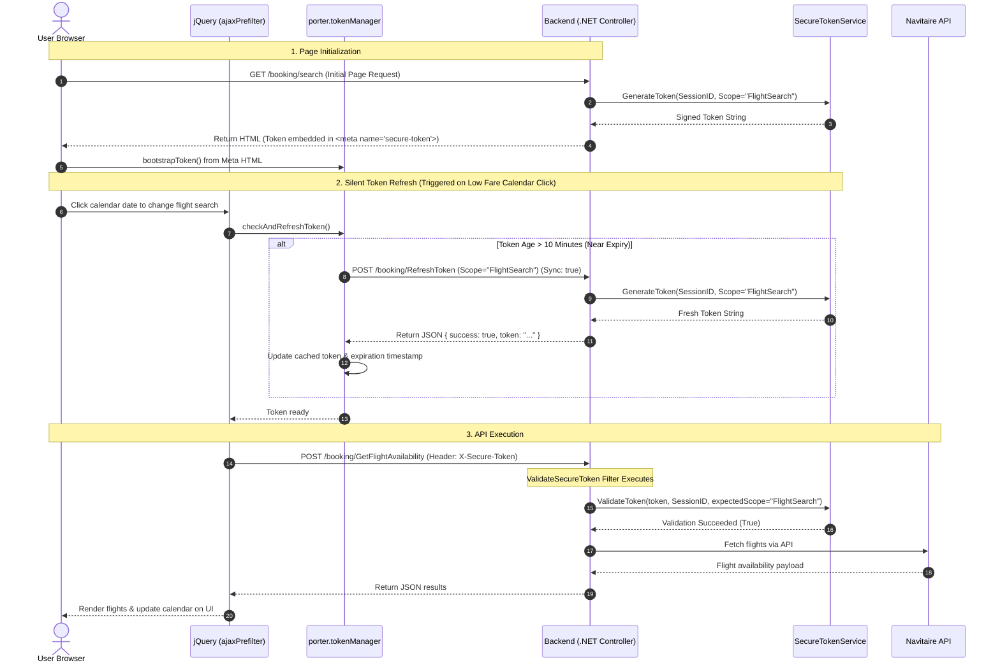
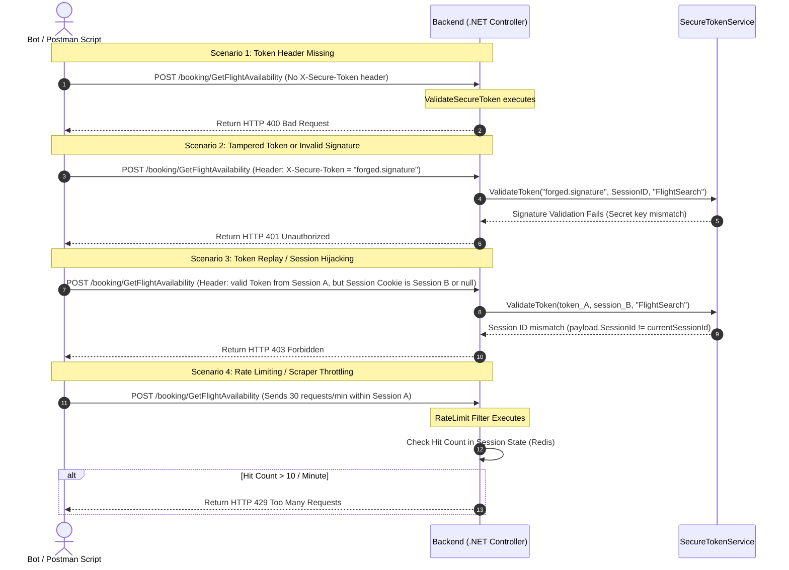

# Solution Design Document: Secure Tokenization Architecture

## 1. Executive Summary

### 1.1 Problem Statement
The public-facing `GetFlightAvailability` API endpoint is currently vulnerable to automated scraping and bot spamming. Attackers can extract valid session signatures from browser sessions and use external tools (e.g., Postman, custom scripts) to execute an overwhelming volume of direct API requests. This bypasses the front-end user interface, exhausts server resources, and leads to site-wide 503 (Service Unavailable) errors.

### 1.2 Proposed Remedy
Transition the endpoint from a client-side signed cookie model to a robust **Server-Verified, Session-Bound Tokenization Framework**. 
* Requests to flight availability must carry a short-lived token cryptographically bound to the active user session.
* The backend will validate the token locally using HMAC-SHA256 signatures with zero external network overhead.
* A client-side "Silent Refresh" mechanism will handle token renewals automatically during SPA (Single Page Application) interactions (like the Low Fare Calendar date changes) without page reloads.

---

## 2. Architecture & Sequence Flows

We illustrate the architecture with two sequence diagrams:
1. **Flow A (Happy Path):** The normal user search journey and silent refresh execution.
2. **Flow B (Threat Mitigation):** How the system blocks automated abuse and responds with standard HTTP status codes.

### 2.1 Flow A: Normal Booking Journey & Silent Refresh

This flow shows how a legitimate browser session acquires, sends, and silently refreshes the session-bound token.



### 2.2 Flow B: Threat Mitigation & Error Code Mapping

This flow demonstrates how various bot-abuse strategies are identified and intercepted at the backend filter layer.



---

## 3. Component Specifications

The framework is divided into reusable backend components and a centralized frontend interceptor.

### 3.1 Backend Components

#### A. `ISecureTokenService` and `SecureTokenService`
* **Purpose:** Handles cryptographic operations. It does not hit the database or any external APIs, keeping verification times sub-millisecond.
* **Cryptography:** HMAC-SHA256 signature verification.
* **Payload Structure:** A JSON string base64url-encoded:
  ```json
  {
    "SessionId": "ASP.NET Session ID",
    "Scope": "FlightSearch",
    "ExpiryTicks": 638600000000000000
  }
  ```
* **Configuration:** Private token key stored securely in `web.config` (`Security.TokenSecret`).

#### B. `[ValidateSecureToken]` Action Filter
* **Purpose:** Decorates controller actions to enforce verification.
* **Logic:**
  1. Reads request header `X-Secure-Token`. If missing -> returns **HTTP 400**.
  2. Decodes payload. If signature is invalid or expiration tick has passed -> returns **HTTP 401**.
  3. Verifies that the payload `SessionId` matches `Session.SessionID` of the current HTTP request. If they do not match -> returns **HTTP 403**.

#### C. `[RateLimit]` Action Filter
* **Purpose:** Safeguards the server against single-session script spamming.
* **Logic:** Counts the requests made within the current session inside the shared Session State (hosted on **Redis**). If a threshold (e.g. 10 requests/min) is exceeded -> returns **HTTP 429**.

---

### 3.2 Frontend Components

#### A. Centralized Token Manager (`porter.tokenManager.js`)
* **Storage:** Stores the token in a private JavaScript closure variable. It is **never** written to `localStorage` or `sessionStorage` to mitigate Cross-Site Scripting (XSS) extraction risks.
* **Silent Refresh:** Periodically checks token lifetime. If the token is older than 10 minutes, it calls `/booking/RefreshToken` synchronously (`async: false`) before executing any flight search, updating the in-memory cache.

#### B. Global jQuery AJAX Prefilter
* Centralizes header injection. It automatically intercepts all outgoing AJAX calls to secured availability routes, ensures token freshness via the manager, and injects the `X-Secure-Token` header.
* Centralizes error handling: If an AJAX request fails with a `401` or `403`, it intercepts the error and displays the standard **"Session Expired"** modal to the user.

---

## 4. Threat Model Analysis (Why this stops bots)

| Bot Strategy | Security Defense Mechanism | Outcome |
| :--- | :--- | :--- |
| **API Replay (Direct post via Postman)** | The token is cryptographically bound to the browser's `SessionID`. Replaying the token requires sending the victim's session cookie. | **Blocked:** Replays fail validation without matching cookies (HTTP 403). Session cookies are set to `HttpOnly`, so scripts cannot steal them. |
| **High-Volume Session Spam** | Rate limits are tracked on the backend session state. | **Blocked:** Once a single session exceeds the human limit, it is rate-limited (HTTP 429). |
| **Session Spinning (Constant cookie creation)** | Attacker constantly initiates new sessions to avoid rate limits. | **Throttled:** Creating C# sessions is resource-heavy. AWS WAF/Cloudflare at the edge will detect and block IPs creating session cookies at high rates. |
| **Token Forgery** | Token signature verification using SHA-256 with a server private secret key. | **Blocked:** Attackers cannot forge signatures without knowing the private key (HTTP 401). |
